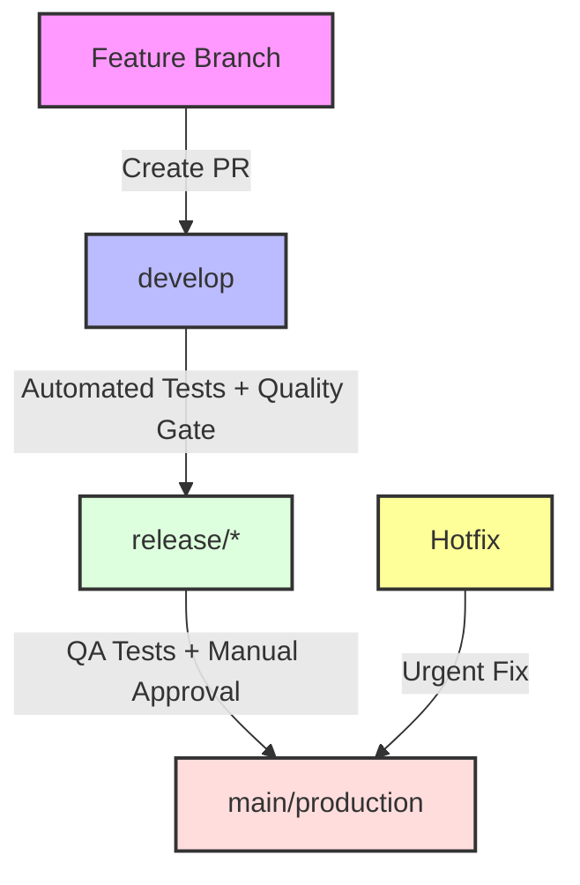
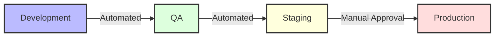

# Enterprise CI/CD Pipeline Implementation Guide for GenAI Projects

This comprehensive guide provides step-by-step instructions for implementing a production-grade CI/CD pipeline for Generative AI projects. It covers advanced features like reusable workflows, multi-environment deployments, code quality gates, and security scanning using GitHub Actions and Azure Cloud.

## Table of Contents
1. [Core Architecture and Principles](#core-architecture-and-principles)
2. [Prerequisites and Setup](#prerequisites-and-setup)
3. [Implementation Steps](#implementation-steps)
4. [Advanced Configuration](#advanced-configuration)
5. [Security Best Practices](#security-best-practices)
6. [Monitoring and Observability](#monitoring-and-observability)
7. [Troubleshooting and Maintenance](#troubleshooting-and-maintenance)

---

## Core Architecture and Principles

### Pipeline Philosophy

The pipeline follows these key principles:

1. **DRY (Don't Repeat Yourself)**: Using reusable workflows to maintain consistency across projects and reduce maintenance overhead
2. **Shift Left Security**: Integrating security checks early in the development cycle to catch vulnerabilities before they reach production
3. **Quality Gates**: Enforcing code quality standards, test coverage thresholds, and model evaluation metrics before deployment
4. **Infrastructure as Code**: Managing all pipeline configurations through version control for auditability and reproducibility
5. **Immutable Deployments**: Using container images with unique SHA-based tags for reliable, traceable deployments
6. **Evaluation-Driven Deployments** (GenAI-specific): Requiring model output quality metrics to pass thresholds before promotion

### GenAI-Specific Considerations

GenAI projects introduce unique CI/CD challenges:

- **Model Artifacts**: Large files require efficient caching strategies (GitHub Actions cache, ACR OCI artifacts)
- **Prompt Versioning**: Prompts should be versioned alongside code for reproducibility
- **Evaluation Gates**: Automated tests must validate model outputs, not just code correctness
- **Data Drift Detection**: Production monitoring should detect input distribution changes
- **Cost Awareness**: Model API calls and GPU inference have cost implications that should be tracked

### Branching Strategy



- **Feature Branches**: For individual feature development, branched from `develop`
- **develop**: Main integration branch where features merge; triggers dev environment deployment
- **release/*** : For QA and staging; created from `develop` when ready for testing
- **main**: Production branch; only accepts merges from `release/*` after approval
- **Hotfix**: Direct fixes to production when critical issues arise; must be backported to `develop`

### Environment Strategy

Each environment has isolated resources for security and compliance:

| Environment | Trigger | ACR | Web App | Approval |
|-------------|---------|-----|---------|----------|
| Development | Push to `develop` | `yourdevacr` | `your-app-dev` | None |
| QA | Push to `release/*` | `yourqaacr` | `your-app-qa` | None |
| Staging | Manual dispatch | `yourstagingacr` | `your-app-staging` | Required |
| Production | Push to `main` | `yourprodacr` | `your-app-prod` | Required (2 reviewers) |



**Why separate ACRs per environment?**
- **Isolation**: Prevents accidental use of dev images in production
- **Compliance**: Production registries can have stricter policies (image signing, vulnerability thresholds)
- **Cost Tracking**: Separate registries enable per-environment cost allocation
- **Cleanup Policies**: Dev can have aggressive retention; prod keeps images longer for rollback

---

## Prerequisites and Setup

### 1. Azure Resources

#### 1.1 Create Resource Group
```bash
az group create --name your-project-rg --location eastus
```

#### 1.2 Create App Service Plan
```bash
# Create a plan for your Web Apps (adjust SKU based on needs)
az appservice plan create \
    --name your-app-plan \
    --resource-group your-project-rg \
    --sku B1 \
    --is-linux
```

#### 1.3 Create Container Registries
```bash
# Development ACR (Basic SKU for cost savings)
az acr create --resource-group your-project-rg \
    --name yourdevacr --sku Basic

# QA ACR
az acr create --resource-group your-project-rg \
    --name yourqaacr --sku Standard

# Production ACR (Premium for geo-replication, private endpoints)
az acr create --resource-group your-project-rg \
    --name yourprodacr --sku Premium
```

#### 1.4 Create Web Apps
```bash
# Development Web App
az webapp create \
    --resource-group your-project-rg \
    --plan your-app-plan \
    --name your-app-dev \
    --deployment-container-image-name yourdevacr.azurecr.io/your-app:latest

# QA Web App
az webapp create \
    --resource-group your-project-rg \
    --plan your-app-plan \
    --name your-app-qa \
    --deployment-container-image-name yourqaacr.azurecr.io/your-app:latest

# Production Web App
az webapp create \
    --resource-group your-project-rg \
    --plan your-app-plan \
    --name your-app-prod \
    --deployment-container-image-name yourprodacr.azurecr.io/your-app:latest
```

#### 1.5 Set Up OIDC Authentication (Recommended)

OIDC federation eliminates the need to store long-lived credentials in GitHub Secrets or enable ACR admin access:

```bash
# Create an Entra ID App Registration
az ad app create --display-name "your-app-github-oidc"

# Get the App ID
APP_ID=$(az ad app list --display-name "your-app-github-oidc" --query "[0].appId" -o tsv)

# Create a service principal
az ad sp create --id $APP_ID

# Assign Contributor role
az role assignment create \
    --assignee $APP_ID \
    --role Contributor \
    --scope /subscriptions/{subscription-id}/resourceGroups/your-project-rg

# Assign ACR Push role (for pushing images from GitHub Actions)
az role assignment create \
    --assignee $APP_ID \
    --role "AcrPush" \
    --scope /subscriptions/{subscription-id}/resourceGroups/your-project-rg

# Add federated credential for GitHub
az ad app federated-credential create \
    --id $APP_ID \
    --parameters '{
        "name": "github-oidc",
        "issuer": "https://token.actions.githubusercontent.com",
        "subject": "repo:your-org/your-repo:environment:production",
        "description": "GitHub Actions OIDC for production deployments",
        "audiences": ["api://AzureADTokenExchange"]
    }'
```

> **Important**: Do NOT enable ACR admin access unless you have a specific legacy requirement. The OIDC service principal with `AcrPush` and `AcrPull` roles provides secure, scoped access without long-lived passwords. If admin access was previously enabled, disable it with `az acr update --name yourdevacr --admin-enabled false`.

**Why OIDC?**
- No secrets to rotate or leak
- Automatic credential expiration (tokens are short-lived)
- Fine-grained access control per branch/environment
- Audit trail in Azure AD

---

### 2. GitHub Repository Setup

#### 2.1 Create GitHub Environments

Navigate to **Settings → Environments → New environment** and create:

1. **development** - No protection rules
2. **qa** - No protection rules
3. **staging** - Required reviewers (1+)
4. **production** - Required reviewers (2+), wait timer (optional)

#### 2.2 Branch Protection Rules

Navigate to **Settings → Branches → Add rule** and configure:

**For `main`:**
```
✓ Require pull request reviews (2 reviewers)
✓ Require status checks to pass
✓ Require branches to be up to date
✓ Include administrators
✓ Require linear history
✓ Do not allow bypassing
```

**For `develop`:**
```
✓ Require pull request reviews (1 reviewer)
✓ Require status checks to pass
✓ Require branches to be up to date
```

**For `release/*`:**
```
✓ Require pull request reviews (1 reviewer)
✓ Require status checks to pass
```

#### 2.3 GitHub Secrets

Navigate to **Settings → Secrets and variables → Actions** and configure:

```yaml
# Azure OIDC (recommended - no long-lived credentials)
AZURE_CLIENT_ID: "your-app-registration-app-id"
AZURE_TENANT_ID: "your-tenant-id"
AZURE_SUBSCRIPTION_ID: "your-subscription-id"

# ACR names (used as variables or secrets for dynamic lookup)
DEV_ACR_NAME: "yourdevacr"
QA_ACR_NAME: "yourqaacr"
PROD_ACR_NAME: "yourprodacr"

# SonarCloud
SONAR_TOKEN: "your-sonar-token"
```

> **Note**: With OIDC authentication, you do NOT need ACR usernames or passwords. The `azure/login@v2` action handles authentication, and the service principal's `AcrPush`/`AcrPull` roles provide registry access. If you must use ACR credentials (e.g., for `docker/login-action` without Azure CLI), store them as environment-scoped secrets and rotate them quarterly.

> **Note**: With OIDC authentication, you do NOT need ACR usernames or passwords. The `azure/login@v2` action handles authentication, and the service principal's `AcrPush`/`AcrPull` roles provide registry access. If you must use ACR credentials (e.g., for `docker/login-action` without Azure CLI), store them as environment-scoped secrets and rotate them quarterly.

#### 2.4 GitHub Variables (Non-Sensitive Configuration)

Navigate to **Settings → Secrets and variables → Actions → Variables** and configure:

```yaml
DOCKER_IMAGE_NAME: "your-app"
PYTHON_VERSION: "3.11"
SONAR_ORGANIZATION: "your-org"
SONAR_PROJECT_KEY: "your-org_your-project"
```

---

## Implementation Steps

### Step 1: Create Central Reusable Workflows

You have two options for storing reusable workflows:

**Option A: Same repository (simpler, recommended for single-project teams)**
Store workflows in the same repo at `.github/workflows/`. Reference them with local paths:
```yaml
uses: ./.github/workflows/reusable-base-workflow.yml
```

**Option B: Dedicated template repository (recommended for multi-project organizations)**
Create a dedicated repository (e.g., `your-org/cicd-templates`) to store reusable workflows. This enables sharing across multiple projects. Reference them with remote paths:
```yaml
uses: your-org/cicd-templates/.github/workflows/reusable-base-workflow.yml@main
```

The examples below use **Option A** (same repo) for simplicity. To use Option B, replace `./.github/workflows/` with `your-org/cicd-templates/.github/workflows/` in all `uses:` lines.

#### 1.1 Base Workflow Template

This workflow handles validation, building, and deploying. It is called by environment-specific workflows.

File: `.github/workflows/reusable-base-workflow.yml`

```yaml
name: Reusable Base Workflow

on:
  workflow_call:
    inputs:
      repository:
        required: true
        type: string
      app-name:
        required: true
        type: string
      environment:
        required: true
        type: string
      docker-repo:
        required: true
        type: string
      acr-name:
        required: true
        type: string
      branch:
        required: true
        type: string
      python-version:
        required: false
        type: string
        default: "3.11"

jobs:
  validate:
    runs-on: ubuntu-latest
    steps:
      - name: Input Validation
        run: |
          echo "Validating inputs..."
          [[ -n "${{ inputs.repository }}" ]] || { echo "Repository is required"; exit 1; }
          [[ -n "${{ inputs.app-name }}" ]] || { echo "App name is required"; exit 1; }
          [[ -n "${{ inputs.environment }}" ]] || { echo "Environment is required"; exit 1; }
          echo "All inputs valid"

  build-and-push:
    needs: validate
    runs-on: ubuntu-latest
    outputs:
      image-tag: ${{ steps.meta.outputs.tags }}
    steps:
      - uses: actions/checkout@v4
        with:
          repository: ${{ inputs.repository }}
          ref: ${{ inputs.branch }}

      - name: Set up Python ${{ inputs.python-version }}
        uses: actions/setup-python@v5
        with:
          python-version: ${{ inputs.python-version }}
          cache: "pip"

      - name: Install dependencies
        run: |
          python -m pip install --upgrade pip
          pip install -r requirements.txt

      - name: Run tests with coverage
        run: |
          pip install pytest pytest-cov
          pytest tests/ --cov=src/ --cov-report=xml --cov-report=html

      - name: Upload coverage report
        uses: actions/upload-artifact@v4
        with:
          name: coverage-report-${{ inputs.environment }}
          path: htmlcov/
          retention-days: 7

      - name: Set up Docker Buildx
        uses: docker/setup-buildx-action@v3

      - name: Log in to ACR
        uses: docker/login-action@v3
        with:
          registry: ${{ inputs.acr-name }}.azurecr.io
          username: ${{ secrets[format('{0}_ACR_USERNAME', inputs.environment)] }}
          password: ${{ secrets[format('{0}_ACR_PASSWORD', inputs.environment)] }}

      - name: Extract metadata
        id: meta
        uses: docker/metadata-action@v5
        with:
          images: ${{ inputs.acr-name }}.azurecr.io/${{ inputs.docker-repo }}
          tags: |
            type=sha,prefix=
            type=raw,value=latest,enable={{is_default_branch}}

      - name: Build and push
        uses: docker/build-push-action@v5
        with:
          context: .
          push: true
          tags: ${{ steps.meta.outputs.tags }}
          cache-from: type=registry,ref=${{ inputs.acr-name }}.azurecr.io/${{ inputs.docker-repo }}:buildcache
          cache-to: type=registry,ref=${{ inputs.acr-name }}.azurecr.io/${{ inputs.docker-repo }}:buildcache,mode=max

  deploy:
    needs: build-and-push
    runs-on: ubuntu-latest
    environment:
      name: ${{ inputs.environment }}
      url: ${{ steps.deploy.outputs.webapp-url }}
    steps:
      - name: Azure Login (OIDC)
        uses: azure/login@v2
        with:
          client-id: ${{ secrets.AZURE_CLIENT_ID }}
          tenant-id: ${{ secrets.AZURE_TENANT_ID }}
          subscription-id: ${{ secrets.AZURE_SUBSCRIPTION_ID }}

      - name: Deploy to Azure Web App
        id: deploy
        uses: azure/webapps-deploy@v3
        with:
          app-name: ${{ inputs.app-name }}
          images: "${{ inputs.acr-name }}.azurecr.io/${{ inputs.docker-repo }}:${{ github.sha }}"

      - name: Post-deployment health check
        run: |
          WEBAPP_URL="${{ steps.deploy.outputs.webapp-url }}"
          HEALTH_URL="${WEBAPP_URL}/health"
          echo "Waiting for service to be healthy at $HEALTH_URL"
          for i in {1..30}; do
            response=$(curl -s -o /dev/null -w "%{http_code}" "$HEALTH_URL" || echo "000")
            if [ "$response" = "200" ]; then
              echo "Health check passed on attempt $i"
              exit 0
            fi
            echo "Attempt $i/30: HTTP $response - waiting..."
            sleep 10
          done
          echo "Health check failed after 30 attempts"
          exit 1
```

#### 1.2 Development Environment Workflow

Adds SonarCloud scanning and Trivy security scanning before calling the base workflow.

File: `.github/workflows/reusable-dev-workflow.yml`

```yaml
name: Reusable Development Workflow

on:
  workflow_call:
    inputs:
      repository:
        required: true
        type: string
      app-name:
        required: true
        type: string
      environment:
        required: true
        type: string
      docker-repo:
        required: true
        type: string
      acr-name:
        required: true
        type: string
      branch:
        required: true
        type: string
        default: "develop"
      python-version:
        required: false
        type: string
        default: "3.11"

jobs:
  quality-check:
    runs-on: ubuntu-latest
    steps:
      - uses: actions/checkout@v4
        with:
          fetch-depth: 0

      - name: Set up Python
        uses: actions/setup-python@v5
        with:
          python-version: ${{ inputs.python-version }}
          cache: "pip"

      - name: Install dependencies
        run: |
          python -m pip install --upgrade pip
          pip install -r requirements.txt
          pip install pytest pytest-cov

      - name: Run tests with coverage
        run: pytest tests/ --cov=src/ --cov-report=xml

      - name: SonarCloud Scan
        uses: SonarSource/sonarcloud-github-action@v3
        env:
          GITHUB_TOKEN: ${{ secrets.GITHUB_TOKEN }}
          SONAR_TOKEN: ${{ secrets.SONAR_TOKEN }}
        with:
          args: >
            -Dsonar.projectKey=${{ inputs.repository }}
            -Dsonar.organization=${{ vars.SONAR_ORGANIZATION }}
            -Dsonar.python.coverage.reportPaths=coverage.xml
            -Dsonar.python.version=${{ inputs.python-version }}

  call-base-workflow:
    needs: quality-check
    uses: ./.github/workflows/reusable-base-workflow.yml
    with:
      repository: ${{ inputs.repository }}
      app-name: ${{ inputs.app-name }}
      environment: ${{ inputs.environment }}
      docker-repo: ${{ inputs.docker-repo }}
      acr-name: ${{ inputs.acr-name }}
      branch: ${{ inputs.branch }}
      python-version: ${{ inputs.python-version }}
    secrets: inherit

  security-scan:
    needs: call-base-workflow
    runs-on: ubuntu-latest
    steps:
      - name: Run Trivy vulnerability scanner
        uses: aquasecurity/trivy-action@master
        with:
          image-ref: "${{ inputs.acr-name }}.azurecr.io/${{ inputs.docker-repo }}:${{ github.sha }}"
          format: "sarif"
          output: "trivy-results.sarif"
          exit-code: "0"

      - name: Upload Trivy results to GitHub Security
        uses: github/codeql-action/upload-sarif@v3
        with:
          sarif_file: "trivy-results.sarif"
```

#### 1.3 QA Environment Workflow

Adds integration tests and stricter security scanning.

File: `.github/workflows/reusable-qa-workflow.yml`

```yaml
name: Reusable QA Workflow

on:
  workflow_call:
    inputs:
      repository:
        required: true
        type: string
      app-name:
        required: true
        type: string
      environment:
        required: true
        type: string
      docker-repo:
        required: true
        type: string
      acr-name:
        required: true
        type: string
      branch:
        required: true
        type: string
      python-version:
        required: false
        type: string
        default: "3.11"

jobs:
  quality-check:
    runs-on: ubuntu-latest
    steps:
      - uses: actions/checkout@v4
        with:
          fetch-depth: 0

      - name: SonarCloud Scan
        uses: SonarSource/sonarcloud-github-action@v3
        env:
          GITHUB_TOKEN: ${{ secrets.GITHUB_TOKEN }}
          SONAR_TOKEN: ${{ secrets.SONAR_TOKEN }}
        with:
          args: >
            -Dsonar.projectKey=${{ inputs.repository }}
            -Dsonar.organization=${{ vars.SONAR_ORGANIZATION }}

  call-base-workflow:
    needs: quality-check
    uses: ./.github/workflows/reusable-base-workflow.yml
    with:
      repository: ${{ inputs.repository }}
      app-name: ${{ inputs.app-name }}
      environment: ${{ inputs.environment }}
      docker-repo: ${{ inputs.docker-repo }}
      acr-name: ${{ inputs.acr-name }}
      branch: ${{ inputs.branch }}
      python-version: ${{ inputs.python-version }}
    secrets: inherit

  integration-tests:
    needs: call-base-workflow
    runs-on: ubuntu-latest
    steps:
      - uses: actions/checkout@v4

      - name: Run integration tests
        run: |
          # Add integration test commands here
          # Example: pytest tests/integration/ --base-url=${{ needs.call-base-workflow.outputs.webapp-url }}
          echo "Running integration tests..."

  security-scan:
    needs: call-base-workflow
    runs-on: ubuntu-latest
    steps:
      - name: Run Trivy scanner (fail on HIGH+)
        uses: aquasecurity/trivy-action@master
        with:
          image-ref: "${{ inputs.acr-name }}.azurecr.io/${{ inputs.docker-repo }}:${{ github.sha }}"
          format: "table"
          exit-code: "1"
          severity: "HIGH,CRITICAL"
```

#### 1.4 Production Environment Workflow

Adds manual approval gate, stricter security requirements, and deployment notifications.

File: `.github/workflows/reusable-prod-workflow.yml`

```yaml
name: Reusable Production Workflow

on:
  workflow_call:
    inputs:
      repository:
        required: true
        type: string
      app-name:
        required: true
        type: string
      environment:
        required: true
        type: string
      docker-repo:
        required: true
        type: string
      acr-name:
        required: true
        type: string
      branch:
        required: true
        type: string
      python-version:
        required: false
        type: string
        default: "3.11"

jobs:
  quality-check:
    runs-on: ubuntu-latest
    steps:
      - uses: actions/checkout@v4
        with:
          fetch-depth: 0

      - name: SonarCloud Quality Gate
        uses: SonarSource/sonarcloud-github-action@v3
        env:
          GITHUB_TOKEN: ${{ secrets.GITHUB_TOKEN }}
          SONAR_TOKEN: ${{ secrets.SONAR_TOKEN }}
        with:
          args: >
            -Dsonar.projectKey=${{ inputs.repository }}
            -Dsonar.organization=${{ vars.SONAR_ORGANIZATION }}
            -Dsonar.qualitygate.wait=true

  security-audit:
    runs-on: ubuntu-latest
    steps:
      - uses: actions/checkout@v4

      - name: Run Trivy scanner (fail on MEDIUM+)
        uses: aquasecurity/trivy-action@master
        with:
          image-ref: "${{ inputs.acr-name }}.azurecr.io/${{ inputs.docker-repo }}:${{ github.sha }}"
          format: "sarif"
          output: "trivy-results.sarif"
          exit-code: "1"
          severity: "MEDIUM,HIGH,CRITICAL"

      - name: Upload Trivy results
        uses: github/codeql-action/upload-sarif@v3
        with:
          sarif_file: "trivy-results.sarif"

      - name: Run dependency audit
        run: |
          pip install safety
          safety check --full-report

  call-base-workflow:
    needs: [quality-check, security-audit]
    uses: ./.github/workflows/reusable-base-workflow.yml
    with:
      repository: ${{ inputs.repository }}
      app-name: ${{ inputs.app-name }}
      environment: ${{ inputs.environment }}
      docker-repo: ${{ inputs.docker-repo }}
      acr-name: ${{ inputs.acr-name }}
      branch: ${{ inputs.branch }}
      python-version: ${{ inputs.python-version }}
    secrets: inherit

  notify:
    needs: call-base-workflow
    runs-on: ubuntu-latest
    if: always()
    steps:
      - name: Notify deployment status
        run: |
          STATUS="${{ needs.call-base-workflow.result }}"
          echo "Production deployment $STATUS"
          # Add Slack/Teams notification here
```

---

### Step 2: Project-Specific Implementation

In your application repository, create these lightweight workflow files that call the reusable workflows:

#### 2.1 Development Pipeline

File: `.github/workflows/dev-pipeline.yml`

```yaml
name: Development Pipeline

on:
  push:
    branches: [develop]
  pull_request:
    branches: [develop]
  workflow_dispatch:

jobs:
  dev-pipeline:
    uses: your-org/cicd-templates/.github/workflows/reusable-dev-workflow.yml@main
    with:
      repository: ${{ github.repository }}
      app-name: your-app-dev
      environment: development
      docker-repo: your-app
      acr-name: yourdevacr
      branch: develop
    secrets: inherit
```

#### 2.2 QA Pipeline

File: `.github/workflows/qa-pipeline.yml`

```yaml
name: QA Pipeline

on:
  push:
    branches: ["release/*"]
  workflow_dispatch:

jobs:
  qa-pipeline:
    uses: your-org/cicd-templates/.github/workflows/reusable-qa-workflow.yml@main
    with:
      repository: ${{ github.repository }}
      app-name: your-app-qa
      environment: qa
      docker-repo: your-app
      acr-name: yourqaacr
      branch: ${{ github.ref_name }}
    secrets: inherit
```

#### 2.3 Production Pipeline

File: `.github/workflows/prod-pipeline.yml`

```yaml
name: Production Pipeline

on:
  push:
    branches: [main]
  workflow_dispatch:

jobs:
  prod-pipeline:
    uses: your-org/cicd-templates/.github/workflows/reusable-prod-workflow.yml@main
    with:
      repository: ${{ github.repository }}
      app-name: your-app-prod
      environment: production
      docker-repo: your-app
      acr-name: yourprodacr
      branch: main
    secrets: inherit
```

---

## Advanced Configuration

### SonarCloud Configuration

File: `sonar-project.properties`

```properties
# Project identification
sonar.projectKey=your-org_your-project
sonar.organization=your-org
sonar.projectName=Your Project Name

# Source configuration
sonar.sources=src
sonar.tests=tests
sonar.python.version=3.11

# Coverage reports
sonar.python.coverage.reportPaths=coverage.xml

# Exclusions
sonar.exclusions=**/*.pyc,**/__pycache__/**,**/migrations/**,**/tests/**
sonar.test.exclusions=**/tests/**

# Quality gate thresholds (configure in SonarCloud UI)
# - Coverage on new code: >= 80%
# - Duplicated lines: <= 3%
# - Maintainability rating: A
# - Reliability rating: A
# - Security rating: A
```

**Setting up Quality Gates in SonarCloud:**

1. Navigate to your SonarCloud project
2. Go to **Quality Gates** → **Create**
3. Configure thresholds:
   - Coverage on New Code: ≥ 80%
   - Duplicated Lines on New Code: ≤ 3%
   - Maintainability Rating: A
   - Reliability Rating: A
   - Security Rating: A
4. Set as default quality gate

### Dockerfile Best Practices

```dockerfile
# Stage 1: Build dependencies
FROM python:3.11-slim as builder

WORKDIR /app
COPY requirements.txt .
RUN pip install --user --no-cache-dir -r requirements.txt

# Stage 2: Runtime
FROM python:3.11-slim

WORKDIR /app

# Copy dependencies from builder
COPY --from=builder /root/.local /root/.local

# Copy application code
COPY src/ ./src/

# Set environment variables
ENV PATH=/root/.local/bin:$PATH
ENV PYTHONPATH=/app
ENV PYTHONUNBUFFERED=1

# Create non-root user
RUN useradd -m appuser && chown -R appuser:appuser /app
USER appuser

# Health check
HEALTHCHECK --interval=30s --timeout=10s --start-period=5s --retries=3 \
    CMD python -c "import urllib.request; urllib.request.urlopen('http://localhost:8000/health')" || exit 1

# Expose port
EXPOSE 8000

# Run application
CMD ["python", "-m", "src.main"]
```

**Why multi-stage builds?**
- **Smaller images**: Build tools and intermediate files are discarded
- **Security**: Production image contains only runtime dependencies
- **Faster pulls**: Smaller images deploy faster

### .dockerignore

```
__pycache__/
*.pyc
*.pyo
.env
.venv/
venv/
.git/
.github/
tests/
htmlcov/
.coverage
coverage.xml
*.md
Dockerfile
.dockerignore
```

---

## Security Best Practices

### 1. Secrets Management

**Do:**
- Use GitHub OIDC for Azure authentication (no long-lived credentials)
- Store secrets in GitHub Encrypted Secrets (AES-256 encrypted at rest)
- Use environment-scoped secrets for production
- Rotate ACR passwords quarterly
- Use Azure Key Vault for application secrets at runtime

**Don't:**
- Hardcode credentials in workflow files
- Print secrets in logs (GitHub auto-redacts, but verify)
- Use organization-level secrets for project-specific values

**Implement Dependabot for secret scanning:**

File: `.github/dependabot.yml`
```yaml
version: 2
updates:
  - package-ecosystem: "github-actions"
    directory: "/"
    schedule:
      interval: "weekly"
  - package-ecosystem: "pip"
    directory: "/"
    schedule:
      interval: "weekly"
```

### 2. Container Security

**Base Image Hygiene:**
- Pin base image versions (`python:3.11-slim@sha256:...`)
- Use minimal base images (`slim`, `alpine`)
- Regularly rebuild images to pick up security patches

**Scanning Pipeline:**
- Trivy scans on every build (dev)
- Block deployments on HIGH/CRITICAL vulnerabilities (qa/prod)
- Generate SBOMs for compliance

**Generate SBOM with Syft:**
```yaml
- name: Generate SBOM
  uses: anchore/sbom-action@v0
  with:
    image: ${{ inputs.acr-name }}.azurecr.io/${{ inputs.docker-repo }}:${{ github.sha }}
    format: spdx-json
    output-file: sbom.spdx.json
```

### 3. Code Security

**Enable GitHub Secret Scanning:**
1. Go to **Settings → Code security and analysis**
2. Enable **Secret scanning**
3. Enable **Push protection**

**SAST with CodeQL:**

File: `.github/workflows/codeql.yml`
```yaml
name: CodeQL Analysis

on:
  push:
    branches: [develop, main]
  pull_request:
    branches: [develop]
  schedule:
    - cron: "0 6 * * 1"

jobs:
  analyze:
    runs-on: ubuntu-latest
    permissions:
      security-events: write
    steps:
      - uses: actions/checkout@v4

      - name: Initialize CodeQL
        uses: github/codeql-action/init@v3
        with:
          languages: python

      - name: Perform CodeQL Analysis
        uses: github/codeql-action/analyze@v3
```

### 4. Supply Chain Security

**Pin Actions to SHA:**
```yaml
# Instead of:
- uses: actions/checkout@v4

# Use (more secure):
- uses: actions/checkout@b4ffde65f46336ab88eb53be808477a3936bae11 # v4.1.1
```

**Use OpenSSF Scorecard:**
```yaml
- name: Run Scorecard
  uses: ossf/scorecard-action@v2.3.1
  with:
    results_file: results.sarif
    results_format: sarif
```

---

## Monitoring and Observability

### Azure Application Insights

**Enable during Web App creation:**
```bash
az monitor app-insights component create \
    --app your-app-prod-insights \
    --location eastus \
    --resource-group your-project-rg \
    --application-type web
```

**Add to Web App configuration:**
```bash
az webapp config appsettings set \
    --resource-group your-project-rg \
    --name your-app-prod \
    --settings APPLICATIONINSIGHTS_CONNECTION_STRING="<connection-string>"
```

### Key Metrics to Monitor

| Metric | Alert Threshold | Action |
|--------|-----------------|--------|
| HTTP 5xx errors | > 1% of requests | Investigate immediately |
| Response time (p95) | > 2 seconds | Check resource utilization |
| Container restarts | > 3 in 5 minutes | Check logs for crashes |
| Memory usage | > 80% | Scale up or optimize |
| CPU usage | > 70% sustained | Scale out |

### Log Queries

**Recent errors:**
```kusto
requests
| where success == false
| project timestamp, url, resultCode, duration
| order by timestamp desc
| limit 50
```

**Slow requests:**
```kusto
requests
| where duration > 2000
| project timestamp, url, duration
| order by duration desc
| limit 20
```

---

## Troubleshooting and Maintenance

### Common Issues and Solutions

#### 1. Docker Build Failures

**Symptom:** Build fails with "no space left on device"
```bash
# On self-hosted runners, clear build cache
docker builder prune -af
docker system prune -af
```

**Symptom:** "manifest unknown" during push
```bash
# Verify ACR exists and you have permissions
az acr show --name yourdevacr --query "loginServer" -o tsv
az acr login --name yourdevacr
```

#### 2. Pipeline Timeouts

**Solution:** Increase timeout per job
```yaml
jobs:
  build:
    runs-on: ubuntu-latest
    timeout-minutes: 45
```

**For long-running tests, use matrix to parallelize:**
```yaml
jobs:
  test:
    runs-on: ubuntu-latest
    strategy:
      matrix:
        test-group: [unit, integration, e2e]
    steps:
      - run: pytest tests/${{ matrix.test-group }}/
```

#### 3. Azure Deployment Failures

**Check Web App logs:**
```bash
az webapp log tail \
    --name your-app-dev \
    --resource-group your-project-rg
```

**Check deployment history:**
```bash
az webapp deployment list-publishing-profiles \
    --name your-app-dev \
    --resource-group your-project-rg
```

#### 4. Authentication Failures

**OIDC issues:**
```bash
# Verify federated credential exists
az ad app federated-credential list --id <app-id>

# Check token audience
echo $ACTIONS_ID_TOKEN_REQUEST_TOKEN | cut -d. -f2 | base64 -d
```

**ACR login issues:**
```bash
# Verify admin is enabled
az acr show --name yourdevacr --query "adminUserEnabled" -o tsv

# Regenerate password if needed
az acr credential renew --name yourdevacr --password-name password
```

#### 5. SonarCloud Scan Failures

**Common causes:**
- Missing `SONAR_TOKEN` secret
- Incorrect `sonar.projectKey`
- Coverage file not generated

**Debug:**
```yaml
- name: Debug SonarCloud
  run: |
    ls -la coverage.xml || echo "Coverage file missing!"
    echo "SONAR_TOKEN is set: ${{ secrets.SONAR_TOKEN != '' }}"
```

### Rollback Procedures

**Manual rollback via Azure CLI:**
```bash
# List deployment slots
az webapp deployment slot list \
    --name your-app-prod \
    --resource-group your-project-rg

# Swap back to previous slot
az webapp deployment slot swap \
    --name your-app-prod \
    --resource-group your-project-rg \
    --slot staging \
    --target-slot production
```

**Rollback via GitHub Actions (manual dispatch):**
```yaml
name: Rollback Production

on:
  workflow_dispatch:
    inputs:
      previous-sha:
        description: "Commit SHA to rollback to"
        required: true
        type: string

jobs:
  rollback:
    runs-on: ubuntu-latest
    environment: production
    steps:
      - name: Deploy previous version
        uses: azure/webapps-deploy@v3
        with:
          app-name: your-app-prod
          images: "yourprodacr.azurecr.io/your-app:${{ inputs.previous-sha }}"
```

### Maintenance Tasks

#### 1. Update GitHub Actions Versions

**Use Dependabot (recommended):**
```yaml
# .github/dependabot.yml
version: 2
updates:
  - package-ecosystem: "github-actions"
    directory: "/"
    schedule:
      interval: "weekly"
    commit-message:
      prefix: "ci"
```

**Avoid:** Using `sed` to bulk-update versions—this can break workflows if versions skip breaking changes.

#### 2. ACR Cleanup

**Use native retention policies (recommended):**
```bash
# Set retention policy for dev ACR (keep 7 days)
az acr repository update \
    --name yourdevacr \
    --image your-app \
    --delete-enabled true \
    --write-enabled true

# Configure ACR task for automated cleanup
az acr task create \
    --name cleanup \
    --registry yourdevacr \
    --cmd "acr purge --filter 'your-app:.*' --untagged --ago 7d" \
    --schedule "0 2 * * *"
```

#### 3. Update Base Images

**Automate with Renovate or Dependabot:**
```json
// renovate.json
{
  "$schema": "https://docs.renovatebot.com/renovate-schema.json",
  "extends": ["config:recommended"],
  "dockerfile": {
    "enabled": true
  }
}
```

#### 4. Regular Security Audits

**Monthly checklist:**
- [ ] Review GitHub Action permissions
- [ ] Rotate ACR passwords
- [ ] Check for vulnerable dependencies
- [ ] Review SonarCloud quality gate results
- [ ] Verify OIDC federated credentials
- [ ] Audit Azure role assignments

---

This documentation provides a complete foundation for implementing and maintaining a production-grade CI/CD pipeline for GenAI projects. Regularly review and update workflows as new best practices and security requirements emerge.
