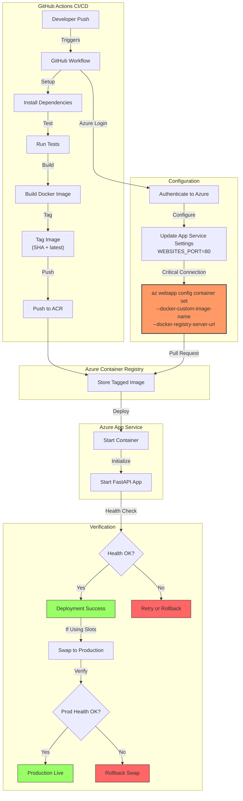

# Production-Ready FastAPI Deployment to Azure App Service

This guide provides a robust, production-ready implementation for deploying FastAPI applications to Azure App Service using GitHub Actions. It includes critical components often missed in basic setups: proper authentication, container settings, deployment slots, health checks, and build optimizations.

## Prerequisites

Before following this guide, ensure you have:
1. An Azure account with appropriate permissions
2. GitHub account with a repository for your FastAPI project
3. Azure CLI installed and configured (`az login`)
4. Git installed and configured
5. Docker installed (for local testing)
6. Basic understanding of:
   - FastAPI framework
   - Containerization concepts
   - GitHub Actions workflows
   - Azure App Service and Container Registry

## Why This Architecture?

Understanding the reasoning behind architectural decisions helps you adapt this pattern to your specific needs:

### Container-Based Deployment
We use container deployment rather than direct code deployment because:
- Ensures consistency between development, testing, and production environments
- Provides isolation and security boundaries
- Enables rapid rollbacks by simply pointing to a previous image
- Facilitates blue/green deployment strategies through deployment slots

### OIDC Authentication
We use OpenID Connect (OIDC) instead of service principals with secrets because:
- Eliminates long-lived secrets that could be leaked
- Provides just-in-time access with automatic token expiration
- Reduces credential management overhead
- Integrates natively with GitHub Actions security model

### Deployment Slots
We leverage Azure App Service deployment slots because:
- Enable zero-downtime deployments through warm-up periods
- Allow testing in production-like environment before full cutover
- Provide instant rollback capability by swapping slots
- Support A/B testing scenarios

### Health Checks with Automatic Rollback
Our implementation includes health checks because:
- Prevents deploying unhealthy instances that would impact users
- Provides automatic detection of deployment issues
- Enables self-healing through automatic rollback mechanisms
- Gives confidence in deployment reliability

### Build Caching
We implement multi-stage Docker build caching because:
- Significantly reduces build times for subsequent deployments
- Optimizes resource utilization in CI/CD pipelines
- Maintains consistency while improving efficiency
- Leverages registry-based cache sharing across workflow runs

## Implementation Architecture

```plaintext
your-fastapi-project/
├── .github/
│   └── workflows/
│       ├── deploy.yml                # Trigger workflow
│       └── reusable-workflow.yml     # Reusable implementation
├── app/
│   ├── main.py                      # FastAPI application
│   └── requirements.txt             # Python dependencies
├── infrastructure/
│   └── setup.sh                     # Azure resource setup
└── Dockerfile                       # Hardened container definition
```

## 1. Azure Infrastructure Setup

> **Note**: This section establishes the foundation for container deployment by setting up the Azure resources and their connections.

Create `infrastructure/setup.sh`:
```bash
#!/bin/bash

# Create base resources
az group create --name fastapi-rg --location eastus

az acr create --resource-group fastapi-rg \
    --name yourfastapiregistry --sku Basic

az appservice plan create --resource-group fastapi-rg \
    --name fastapi-plan --sku B1 --is-linux

az webapp create --resource-group fastapi-rg \
    --plan fastapi-plan --name your-fastapi-app \
    --deployment-container-image-name yourfastapiregistry.azurecr.io/your-fastapi-app:latest

# Create staging slot
az webapp deployment slot create \
    -g fastapi-rg -n your-fastapi-app --slot staging

# Enable system-assigned identity on the Web App
az webapp identity assign -g fastapi-rg -n your-fastapi-app

# CRITICAL CONNECTION: Grant AcrPull to the Web App identity
# This enables App Service to pull images from ACR without credentials
ACR_ID=$(az acr show -g fastapi-rg -n yourfastapiregistry --query id -o tsv)
WEBAPP_PRINCIPAL=$(az webapp show -g fastapi-rg -n your-fastapi-app \
    --query identity.principalId -o tsv)
az role assignment create --assignee $WEBAPP_PRINCIPAL \
    --role "AcrPull" --scope $ACR_ID

# Configure critical app settings
az webapp config appsettings set -g fastapi-rg -n your-fastapi-app \
    --settings \
    WEBSITES_PORT=80 \
    WEBSITES_CONTAINER_START_TIME_LIMIT=180 \
    DOCKER_ENABLE_CI=true

# Enable container logging
az webapp log config -g fastapi-rg -n your-fastapi-app \
    --docker-container-logging filesystem
```

## 2. Hardened Multi-Stage Dockerfile

```dockerfile
# ============================================================
# Stage 1: Build dependencies
# ============================================================
FROM python:3.11-slim AS builder

ENV PYTHONDONTWRITEBYTECODE=1 \
    PYTHONUNBUFFERED=1 \
    PIP_NO_CACHE_DIR=1

WORKDIR /build

COPY requirements.txt .
RUN pip install --prefix=/install -r requirements.txt

# ============================================================
# Stage 2: Production runtime
# ============================================================
FROM python:3.11-slim AS production

ENV PYTHONDONTWRITEBYTECODE=1 \
    PYTHONUNBUFFERED=1 \
    PORT=80 \
    WORKERS=4 \
    LOG_LEVEL=info \
    PYTHONPATH=/app

WORKDIR /app

# Copy installed dependencies from builder
COPY --from=builder /install /usr/local

# Install curl for health checks
RUN apt-get update && apt-get install -y --no-install-recommends \
    curl \
    && rm -rf /var/lib/apt/lists/*

# Create non-root user first
RUN useradd --create-home --shell /bin/bash appuser

# Copy application code
COPY --chown=appuser:appuser ./app ./app

# Switch to non-root user
USER appuser

EXPOSE ${PORT}

# Docker-level health check
HEALTHCHECK --interval=30s --timeout=5s --start-period=10s --retries=3 \
    CMD curl -f http://localhost:${PORT}/health || exit 1

CMD ["uvicorn", "app.main:app", "--host", "0.0.0.0", "--port", "80", "--workers", "4"]
```

**Why multi-stage builds?**
- **Smaller images**: Build tools and intermediate files are discarded
- **Security**: Production image contains only runtime dependencies
- **Faster pulls**: Smaller images deploy faster to Azure App Service

## 3. FastAPI Application with Health Check

File: `app/main.py`
```python
import os
from fastapi import FastAPI, status
from fastapi.middleware.cors import CORSMiddleware
from fastapi.responses import JSONResponse

app = FastAPI(title="Production FastAPI App")

# Restrict CORS to known origins in production
allowed_origins = os.getenv(
    "ALLOWED_ORIGINS",
    "https://yourdomain.com,https://your-app.azurewebsites.net"
).split(",")

app.add_middleware(
    CORSMiddleware,
    allow_origins=allowed_origins,
    allow_credentials=True,
    allow_methods=["GET", "POST", "PUT", "DELETE"],
    allow_headers=["Authorization", "Content-Type"],
)

@app.get("/health", status_code=status.HTTP_200_OK)
async def health_check():
    return JSONResponse(
        status_code=status.HTTP_200_OK,
        content={"status": "healthy"}
    )

@app.get("/")
async def root():
    return {"message": "FastAPI app is running"}
```

## 4. Production-Ready Workflow Implementation

### Understanding Container Deployment Connection

> **CRITICAL SECTION: How CI/CD connects to Azure App Service**

The connection between your CI/CD pipeline and Azure App Service container deployment relies on two key components:

1. **Workflow Input Parameters**: These tell the CI/CD pipeline **where** to deploy
   ```yaml
   # In deploy.yml
   with:
     app-name: your-fastapi-app         # Target App Service name
     acr-name: yourfastapiregistry      # Container registry name
     acr-login-server: yourfastapiregistry.azurecr.io  # Registry URL
   ```

2. **Container Configuration Commands**: These tell Azure App Service **what** to deploy
   ```yaml
   # The critical connection point in the workflow
   az webapp config container set \
     -g fastapi-rg -n ${{ inputs.app-name }} \
     --docker-custom-image-name ${{ env.ACR }}/${{ env.IMAGE_NAME }}:${{ env.IMAGE_TAG }} \
     --docker-registry-server-url https://${{ env.ACR }}
   ```

This creates a deployment chain where:
1. GitHub Actions builds a container with a unique tag (the git SHA)
2. The container is pushed to Azure Container Registry
3. The workflow updates App Service configuration to point to the new container
4. App Service pulls and runs the new container image

Without these specific configuration commands, App Service wouldn't know which container to use or where to find it.

### Main Trigger Workflow
File: `.github/workflows/deploy.yml`
```yaml
name: Deploy FastAPI to Azure
on:
  push:
    branches: [main, develop]
    paths-ignore:
      - '**.md'
      - '.github/workflows/**'
  workflow_dispatch:

jobs:
  deploy-fastapi:
    uses: ./.github/workflows/reusable-workflow.yml
    with:
      app-name: your-fastapi-app
      environment: ${{ github.ref == 'refs/heads/main' && 'production' || 'staging' }}
      python-version: '3.11'
      acr-name: yourfastapiregistry
      acr-login-server: yourfastapiregistry.azurecr.io
      slot: ${{ github.ref == 'refs/heads/develop' && 'staging' || '' }}
    secrets: inherit
```

### Reusable Workflow with OIDC
File: `.github/workflows/reusable-workflow.yml`
```yaml
name: Reusable FastAPI Deploy
on:
  workflow_call:
    inputs:
      app-name: {required: true, type: string}
      environment: {required: true, type: string}
      python-version: {required: true, type: string}
      acr-name: {required: true, type: string}
      acr-login-server: {required: true, type: string}
      slot: {required: false, type: string, default: "staging"}
    secrets:
      AZURE_TENANT_ID: {required: true}
      AZURE_SUBSCRIPTION_ID: {required: true}
      AZURE_CLIENT_ID: {required: true}

jobs:
  build-and-deploy:
    runs-on: ubuntu-latest
    environment: ${{ inputs.environment }}

    permissions:
      id-token: write
      contents: read

    env:
      IMAGE_NAME: ${{ inputs.app-name }}
      IMAGE_TAG: ${{ github.sha }}
      STABLE_TAG: latest
      ACR: ${{ inputs.acr-login-server }}

    steps:
      - uses: actions/checkout@v4

      - name: Set up Python
        uses: actions/setup-python@v5
        with:
          python-version: ${{ inputs.python-version }}
          cache: 'pip'
          cache-dependency-path: |
            requirements.txt

      - name: Install dependencies & run tests
        run: |
          python -m pip install --upgrade pip
          pip install -r requirements.txt
          pip install pytest pytest-cov
          pytest --cov=app --cov-report=xml

      - name: Set up Docker Buildx
        uses: docker/setup-buildx-action@v3

      - name: Azure login (OIDC)
        uses: azure/login@v2
        with:
          client-id: ${{ secrets.AZURE_CLIENT_ID }}
          tenant-id: ${{ secrets.AZURE_TENANT_ID }}
          subscription-id: ${{ secrets.AZURE_SUBSCRIPTION_ID }}

      - name: ACR login
        run: az acr login -n ${{ inputs.acr-name }}

      - name: Build & push image
        uses: docker/build-push-action@v5
        with:
          context: .
          push: true
          tags: |
            ${{ env.ACR }}/${{ env.IMAGE_NAME }}:${{ env.IMAGE_TAG }}
            ${{ env.ACR }}/${{ env.IMAGE_NAME }}:${{ env.STABLE_TAG }}
          cache-from: type=registry,ref=${{ env.ACR }}/${{ env.IMAGE_NAME }}:buildcache
          cache-to: type=registry,ref=${{ env.ACR }}/${{ env.IMAGE_NAME }}:buildcache,mode=max
          provenance: false

      # ==========================================
      # CRITICAL DEPLOYMENT CONNECTION POINT
      # ==========================================
      - name: Configure Web App
        run: |
          # 1. Configure essential App Service settings
          az webapp config appsettings set \
            -g fastapi-rg -n ${{ inputs.app-name }}${{ inputs.slot != '' && format(' -s {0}', inputs.slot) || '' }} \
            --settings \
            WEBSITES_PORT=80 \
            WEBSITES_CONTAINER_START_TIME_LIMIT=180 \
            DOCKER_ENABLE_CI=true

          # 2. THIS IS THE KEY CONNECTION POINT:
          # This command tells Azure App Service exactly which container to deploy
          # - Resource Group + App Name: Identifies WHICH App Service to configure
          # - docker-custom-image-name: Specifies WHICH container image to use (with unique SHA tag)
          # - docker-registry-server-url: Tells App Service WHERE to find the container
          az webapp config container set \
            -g fastapi-rg -n ${{ inputs.app-name }}${{ inputs.slot != '' && format(' -s {0}', inputs.slot) || '' }} \
            --docker-custom-image-name ${{ env.ACR }}/${{ env.IMAGE_NAME }}:${{ env.IMAGE_TAG }} \
            --docker-registry-server-url https://${{ env.ACR }}

      - name: Wait for deployment and check health
        run: |
          echo "Waiting for deployment to complete..."
          sleep 30  # Initial wait for deployment to start

          MAX_RETRIES=10
          RETRY_INTERVAL=30
          HEALTH_URL="https://${{ inputs.app-name }}${{ inputs.slot != '' && format('-{0}', inputs.slot) || '' }}.azurewebsites.net/health"

          for i in $(seq 1 $MAX_RETRIES); do
            HTTP_STATUS=$(curl -s -o /dev/null -w "%{http_code}" $HEALTH_URL)
            if [ "$HTTP_STATUS" -eq 200 ]; then
              echo "Health check passed!"
              exit 0
            fi
            echo "Attempt $i/$MAX_RETRIES: Health check failed. Waiting ${RETRY_INTERVAL}s..."
            sleep $RETRY_INTERVAL
          done

          echo "Health check failed after $MAX_RETRIES attempts"
          exit 1

      - name: Swap slot to production
        if: ${{ inputs.slot != '' && inputs.slot != 'production' && success() }}
        run: |
          az webapp deployment slot swap -g fastapi-rg -n ${{ inputs.app-name }} \
            --slot ${{ inputs.slot }} --target-slot production

      - name: Verify production health
        if: ${{ inputs.slot != '' && inputs.slot != 'production' && success() }}
        run: |
          PROD_HEALTH_URL="https://${{ inputs.app-name }}.azurewebsites.net/health"
          HTTP_STATUS=$(curl -s -o /dev/null -w "%{http_code}" $PROD_HEALTH_URL)
          if [ "$HTTP_STATUS" -ne 200 ]; then
            echo "Production health check failed! Rolling back..."
            az webapp deployment slot swap -g fastapi-rg -n ${{ inputs.app-name }} \
              --slot ${{ inputs.slot }} --target-slot production
            exit 1
          fi
```

## 5. GitHub Repository Setup

1. **Configure OIDC in Azure**:
```bash
# Create AAD application for GitHub Actions
APP_NAME="github-actions-oidc"
APP_ID=$(az ad app create --display-name $APP_NAME --query appId -o tsv)

# Create service principal
SP_ID=$(az ad sp create --id $APP_ID --query id -o tsv)

# Add federated credential
az ad app federated-credential create \
  --id $APP_ID \
  --parameters "{
    \"name\": \"github-federated\",
    \"issuer\": \"https://token.actions.githubusercontent.com\",
    \"subject\": \"repo:your-org/your-repo:environment:production\",
    \"audiences\": [\"api://AzureADTokenExchange\"]
  }"

# Grant contributor access to resource group
az role assignment create \
  --assignee $SP_ID \
  --role Contributor \
  --scope /subscriptions/$SUBSCRIPTION_ID/resourceGroups/fastapi-rg
```

2. **Configure GitHub Secrets**

You need to configure several secrets in your GitHub repository for the workflow to function properly. Here's how to get and set each required secret:

a) **Navigate to GitHub Secrets**:
   - Go to your GitHub repository
   - Click on "Settings" → "Secrets and variables" → "Actions"
   - Click "New repository secret" for each secret

b) **Required Secrets**:

1. **Azure OIDC Authentication Secrets**:
   ```bash
   # Get Azure Tenant ID
   AZURE_TENANT_ID=$(az account show --query tenantId -o tsv)
   
   # Get Azure Subscription ID
   AZURE_SUBSCRIPTION_ID=$(az account show --query id -o tsv)
   
   # Get Azure Client ID (App ID from the OIDC setup above)
   AZURE_CLIENT_ID=$(az ad app show --id $APP_NAME --query appId -o tsv)
   ```
   Add these as secrets:
   - Name: `AZURE_TENANT_ID`
   - Name: `AZURE_SUBSCRIPTION_ID`
   - Name: `AZURE_CLIENT_ID`

2. **Azure Container Registry Secrets** (if not using OIDC):
   ```bash
   # Get ACR credentials
   ACR_NAME="yourfastapiregistry"
   
   # Get ACR login server
   AZURE_REGISTRY=$(az acr show -n $ACR_NAME --query loginServer -o tsv)
   
   # Get ACR username and password
   ACR_USERNAME=$(az acr credential show -n $ACR_NAME --query username -o tsv)
   ACR_PASSWORD=$(az acr credential show -n $ACR_NAME --query passwords[0].value -o tsv)
   ```
   Add these as secrets:
   - Name: `AZURE_REGISTRY`
     - Value: ACR login server (e.g., `yourfastapiregistry.azurecr.io`)
   - Name: `AZURE_REGISTRY_USERNAME`
     - Value: ACR username
   - Name: `AZURE_REGISTRY_PASSWORD`
     - Value: ACR password

3. **Optional: Publish Profile** (alternative to OIDC):
   ```bash
   # Get publish profile
   az webapp deployment list-publishing-profiles \
     -g fastapi-rg -n your-fastapi-app \
     --xml > publish_profile.xml
   
   # Base64 encode the publish profile
   cat publish_profile.xml | base64
   ```
   Add as secret:
   - Name: `AZURE_WEBAPP_PUBLISH_PROFILE`
   - Value: Base64-encoded publish profile XML

c) **Verify Secrets**:
   - After adding all secrets, you should see them listed in the GitHub Secrets page
   - Secrets are encrypted and can only be used by workflows, not read back

d) **Environment Secrets** (Optional):
   If you want to use different secrets for different environments:
   1. Go to "Settings" → "Environments"
   2. Create environments (e.g., "production", "staging")
   3. Add environment-specific secrets
   4. Configure environment protection rules if needed

## 6. Requirements and Dependencies

File: `requirements.txt`
```
fastapi>=0.104.0
uvicorn[standard]>=0.24.0
python-multipart>=0.0.6
pytest>=7.4.3
pytest-cov>=4.1.0
httpx>=0.25.1  # For async tests
```

This implementation includes:
- OIDC authentication for secure Azure access
- Deployment slots for zero-downtime updates
- Health checks with automatic rollback
- Build caching for faster CI
- Non-root container execution
- **Proper container configuration in App Service**
- Automated infrastructure setup
- Production-grade logging and monitoring setup

## Troubleshooting Common Issues

### Authentication Failures
**Symptom**: `az login` fails with "InvalidAuthenticationToken" or "Unauthorized"
**Solution**:
1. Verify that the federated credential in Azure AD matches exactly:
   - Repository name format: `repo:your-org/your-repo:environment:production`
   - Issuer must be `https://token.actions.githubusercontent.com`
   - Audience must include `api://AzureADTokenExchange`
2. Check that the service principal has Contributor role on the resource group
3. Ensure secrets are correctly set in GitHub repository:
   - `AZURE_TENANT_ID`
   - `AZURE_SUBSCRIPTION_ID`
   - `AZURE_CLIENT_ID`

### Container Deployment Issues
**Symptom**: App Service fails to start container or shows crash loop
**Solution**:
1. Check container logs: `az webapp log show -g fastapi-rg -n your-fastapi-app --docker-container-logging`
2. Verify image exists in ACR: `az acr repository show -n yourfastapiregistry --image your-fastapi-app:<SHA>`
3. Test image locally: `docker run -p 8080:80 yourfastapiregistry.azurecr.io/your-fastapi-app:<SHA>`
4. Ensure health check endpoint is accessible and returns 200

### Slot Swap Failures
**Symptom**: Deployment succeeds but slot swap fails or production health check fails
**Solution**:
1. Verify slot exists: `az webapp deployment slot list -g fastapi-rg -n your-fastapi-app`
2. Check that both slots have identical configuration (especially app settings)
3. Ensure production slot doesn't have deployment restrictions
4. Review deployment slot swap logs in Azure Portal

### Build Cache Issues
**Symptom**: Builds are not using cache or cache restoration fails
**Solution**:
1. Verify ACR credentials allow push/pull for build cache
2. Check that build cache image isn't being garbage collected
3. Consider reducing cache retention if experiencing storage issues
4. For persistent issues, disable build caching temporarily to isolate problems

## Verification Steps for GitHub/OIDC Setup

After completing the Azure AD application and federated credential setup, verify your configuration:

1. **Test Azure CLI Login**:
   ```bash
   az login --identity
   ```
   This should work if running in an environment with managed identity.

2. **Verify Federated Credential Configuration**:
   In Azure Portal, navigate to:
   Azure Active Directory → App registrations → [your-app] → Certificates & secrets → Federated credentials
   Ensure you see the GitHub federated credential with correct values.

3. **Check GitHub OIDC Token Permissions**:
   In your workflow, add a debug step to verify token acquisition:
   ```yaml
   - name: Debug OIDC Token
     run: |
       echo "TOKEN RECEIVED: ${{ secrets.AZURE_CLIENT_ID }}"
       # Note: Actual token value is masked for security
   ```

4. **Validate Role Assignments**:
   ```bash
   az role assignment list --assignee <your-client-id> --output table
   ```
   Should show Contributor role on your resource group.

## Understanding Build Caching Implementation

Our build caching strategy uses Docker's registry-based cache mechanism for several important reasons:

### Why Registry-Based Cache?
- **Persistence**: Unlike cache-from local builders, registry cache persists between workflow runs
- **Sharing**: Can be shared across different workflow runs and branches
- **Reliability**: Not dependent on specific runner persistence
- **Scalability**: Works well with self-hosted runners and scalable CI infrastructures

### How It Works:
1. **Cache Import**: `--cache-from` attempts to pull previous cache from ACR
2. **Cache Export**: `--cache-to` pushes updated cache back to ACR after build
3. **Mode Selection**: `mode=max` ensures maximum cache utilization
4. **Cache Image**: Uses a dedicated image (`buildcache`) to avoid interfering with production images

### Cache Invalidation Strategy:
While Docker build cache is intelligent about invalidating layers when inputs change, we should:
- Periodically prune old cache images to manage ACR storage costs
- Consider adding cache busting strategies for dependencies that change infrequently
- Monitor cache hit ratios to optimize build performance

## Slot Swap Strategy and Rollback Mechanism

Our deployment strategy employs a sophisticated slot-based approach with automated verification and rollback:

### Deployment Flow:
1. **Initial Deploy to Staging**: Changes deploy to staging slot first
2. **Warm-up Period**: Application initializes and health checks begin
3. **Health Verification**: Automated polling confirms application responsiveness
4. **Atomic Swap**: Only after successful health checks, slots are swapped
5. **Production Validation**: Post-swap health checks verify production stability
6. **Automatic Rollback**: If production health fails, immediate rollback to previous version

### Why This Approach?
- **Zero Downtime**: Users experience no interruption during deployment
- **Instant Rollback**: Slot swap is instantaneous and reversible
- **Risk Mitigation**: Production-like validation before user exposure
- **Consistency**: Identical environment between staging and production

### Health Check Details:
Our implementation uses:
- **Retry Mechanism**: 10 attempts with 30-second intervals (5-minute total timeout)
- **Endpoint Specific**: Dedicated `/health` endpoint returning 200 OK
- **Failure Detection**: Any non-200 response triggers retry logic
- **Timeout Protection**: Prevents indefinite hanging on unhealthy deployments

### Rollback Triggers:
Automatic rollback occurs when:
1. Post-swap production health check fails
2. Health check timeout exceeded during deployment validation
3. Manual intervention via workflow cancellation (partial cleanup may be needed)

This strategy provides enterprise-grade deployment reliability while maintaining operational simplicity.

## Understanding the Container Deployment Flow

To summarize how the CI/CD pipeline connects with Azure App Service:

1. **Build Phase**: GitHub Actions builds and tags a container with a unique SHA
2. **Registry Phase**: The container is pushed to Azure Container Registry
3. **Configuration Phase**: The workflow configures App Service with:
   - Which registry to use (`--docker-registry-server-url`)
   - Which specific image to deploy (`--docker-custom-image-name`)
4. **Deployment Phase**: App Service pulls and runs the specified container
5. **Verification Phase**: Health checks confirm successful deployment

This connection mechanism ensures that:
- Each deployment uses a unique, traceable container image
- Azure App Service knows exactly which container to pull and run
- The deployment is verified before being considered successful

The workflow ensures reliable, secure deployments with proper error handling and rollback capabilities.

## Visual Deployment Flow Diagram



This diagram illustrates the complete flow from code push to production deployment, highlighting the critical connection point between GitHub Actions and Azure App Service.