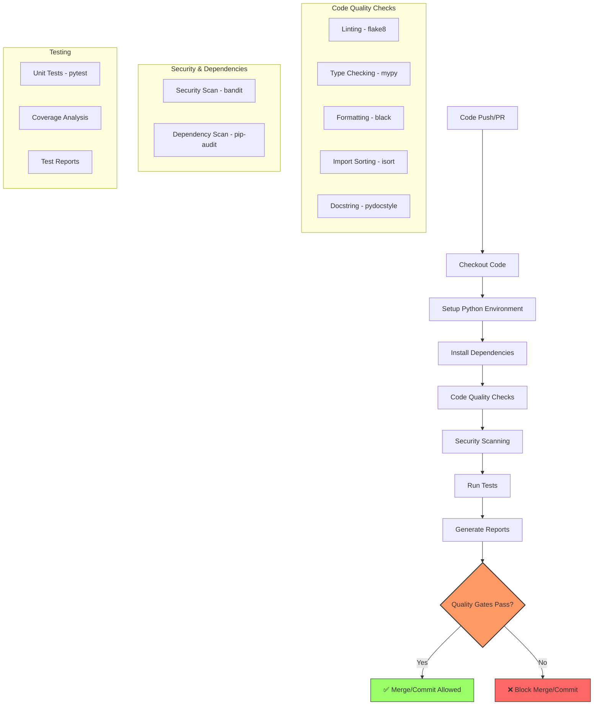

# Python Continuous Integration Workflow Guide

This guide provides a comprehensive approach to implementing a robust Continuous Integration (CI) workflow for Python projects. The focus is on ensuring code quality and testing without deployment, making it suitable for personal projects or team collaborations where quality gates are important before merging code.

## Table of Contents
1. [Prerequisites](#prerequisites)
2. [Overview](#overview)
3. [CI Workflow Architecture](#ci-workflow-architecture)
4. [Quality Gates](#quality-gates)
5. [Workflow Implementation](#workflow-implementation)
6. [Unified Configuration with pyproject.toml](#unified-configuration-with-pyprojecttoml)
7. [Local Development Integration](#local-development-integration)
8. [Customization Guide](#customization-guide)
9. [Cross-Platform Support](#cross-platform-support)
10. [Handling Special Project Types](#handling-special-project-types)
11. [Troubleshooting](#troubleshooting)
12. [Alternative CI Systems](#alternative-ci-systems)

---

## Prerequisites

Before implementing this CI workflow, ensure you have:

- **Python 3.9+** installed locally (for testing configurations)
- **Git** installed and a GitHub repository set up
- **Basic familiarity** with Python packaging (pip, requirements.txt, or pyproject.toml)
- **A GitHub account** with repository admin access (for enabling Actions)

> **Note:** This guide covers CI only (code quality + testing). For Continuous Deployment (CD), see the companion guide on deployment pipelines.

**Estimated implementation time:** 30-60 minutes for a standard project.

---

## Overview

Continuous Integration for Python projects involves automatically checking code quality, running tests, and validating that new changes meet project standards before they are merged. This workflow focuses on:

- Code style and quality enforcement
- Static type checking
- Security vulnerability scanning
- Comprehensive test execution
- Dependency management
- Documentation quality

### Who This Guide Is For

- Individual developers wanting to professionalize their Python projects
- Teams establishing consistent code quality standards
- Organizations migrating from manual code review to automated quality gates

### Benefits

- Catch issues early in the development cycle (shift-left testing)
- Maintain consistent code quality across the project
- Prevent security vulnerabilities from being introduced
- Ensure test coverage for new features and changes
- Automate repetitive code quality tasks
- Reduce code review burden by catching style/formatting issues automatically

---

## CI Workflow Architecture

The CI workflow follows this process, designed with a **fail-fast** philosophy:



### Design Rationale

The pipeline order is intentional:

1. **Fast-fail first:** Formatting and linting checks (black, isort, flake8) execute before tests because they are fast and catch issues that would cause tests to fail anyway. This saves CI minutes.
2. **Security in parallel:** Security scanning (bandit, pip-audit) can run in parallel with quality checks since they are independent.
3. **Tests last:** Tests are the slowest step and depend on code passing quality gates, so they run after.
4. **Coverage as final gate:** Coverage threshold enforcement runs after tests complete, using the generated report.

### Parallelization Strategy

For larger projects, consider splitting the workflow into separate jobs:

```yaml
jobs:
  lint:
    runs-on: ubuntu-latest
    steps: [black, isort, flake8, mypy, pydocstyle]
    
  security:
    runs-on: ubuntu-latest
    steps: [bandit, pip-audit]
    
  test:
    needs: [lint, security]
    runs-on: ubuntu-latest
    steps: [pytest, coverage]
```

This allows lint and security checks to run concurrently, reducing total CI time.

---

## Quality Gates

Quality gates are predefined thresholds that code must pass before being accepted. These gates ensure that only high-quality code makes it into your repository.

| Gate | Tool | Default Threshold | Description |
|------|------|-------------------|-------------|
| Code Style | flake8 | 0 errors | Enforces PEP 8 style guide |
| Type Checking | mypy | 0 errors | Ensures proper type annotations |
| Code Formatting | black | 0 formatting errors | Maintains consistent code style |
| Import Sorting | isort | 0 sorting errors | Organizes imports consistently |
| Security | bandit | 0 high/critical issues | Identifies security vulnerabilities in code |
| Dependency Security | pip-audit | 0 known vulnerabilities | Checks dependencies against vulnerability databases |
| Test Coverage | pytest-cov | 80% minimum | Ensures adequate test coverage |
| Documentation | pydocstyle | 0 errors | Validates docstring quality |

### Choosing Thresholds

- **New projects:** Start with 80% coverage and tighten over time
- **Legacy projects:** Begin at 50-60% and increase by 5% per sprint
- **Critical systems:** Consider 90%+ coverage with branch coverage enabled
- **Security:** Always enforce 0 high/critical issues; low/medium can be warnings initially

### Understanding Bandit Severity Levels

- **HIGH/CRITICAL:** Immediate security risks (e.g., SQL injection, hardcoded passwords). Must fail the build.
- **MEDIUM:** Potential issues requiring review (e.g., use of `eval()`). Consider failing.
- **LOW:** Informational (e.g., debug statements). Can be warnings.

---

## Workflow Implementation

Below is the complete GitHub Actions workflow file that implements the CI pipeline. Save this as `.github/workflows/python-ci.yml`.

```yaml
name: Python CI

on:
  push:
    branches: [ main, develop ]
  pull_request:
    branches: [ main, develop ]
  workflow_dispatch:

env:
  PYTHON_VERSION: "3.11"
  SRC_DIR: "src"
  TEST_DIR: "tests"

jobs:
  quality:
    name: Code Quality & Tests
    runs-on: ${{ matrix.os }}
    strategy:
      matrix:
        python-version: ["3.9", "3.10", "3.11", "3.12"]
        os: [ubuntu-latest, macos-latest, windows-latest]
        exclude:
          # Skip macOS and Windows for non-primary Python versions to reduce CI time
          - python-version: "3.9"
            os: macos-latest
          - python-version: "3.9"
            os: windows-latest
          - python-version: "3.10"
            os: macos-latest
          - python-version: "3.10"
            os: windows-latest
      fail-fast: false

    steps:
      - uses: actions/checkout@v4
        with:
          fetch-depth: 0

      - name: Set up Python ${{ matrix.python-version }}
        uses: actions/setup-python@v5
        with:
          python-version: ${{ matrix.python-version }}
          cache: 'pip'

      - name: Install system dependencies (Ubuntu)
        if: runner.os == 'Linux'
        run: |
          sudo apt-get update
          sudo apt-get install -y build-essential libffi-dev libssl-dev

      - name: Install system dependencies (macOS)
        if: runner.os == 'macOS'
        run: |
          brew install openssl readline

      - name: Detect project structure
        id: detect
        shell: bash
        run: |
          if [ -d "src" ]; then
            echo "src_dir=src" >> $GITHUB_OUTPUT
          elif [ -d "app" ]; then
            echo "src_dir=app" >> $GITHUB_OUTPUT
          else
            echo "src_dir=." >> $GITHUB_OUTPUT
          fi
          
          if [ -d "tests" ]; then
            echo "test_dir=tests" >> $GITHUB_OUTPUT
          elif [ -d "test" ]; then
            echo "test_dir=test" >> $GITHUB_OUTPUT
          else
            echo "test_dir=." >> $GITHUB_OUTPUT
          fi

      - name: Install dependencies
        shell: bash
        run: |
          python -m pip install --upgrade pip
          
          if [ -f "pyproject.toml" ]; then
            if grep -q "\[tool.poetry" pyproject.toml; then
              pip install poetry
              poetry install --with dev
            elif grep -q "\[project\]" pyproject.toml; then
              pip install -e ".[dev,test]"
            else
              pip install -e .
            fi
          elif [ -f "requirements.txt" ]; then
            pip install -r requirements.txt
            if [ -f "requirements-dev.txt" ]; then
              pip install -r requirements-dev.txt
            fi
            if [ -f "requirements-test.txt" ]; then
              pip install -r requirements-test.txt
            fi
          elif [ -f "setup.py" ]; then
            pip install -e ".[dev,test]"
          fi
          
          pip install pytest pytest-cov black isort flake8 mypy pydocstyle bandit pip-audit

      - name: Check code formatting
        shell: bash
        run: |
          black --check .
          isort --check .

      - name: Lint with flake8
        shell: bash
        run: |
          SRC="${{ steps.detect.outputs.src_dir }}"
          TST="${{ steps.detect.outputs.test_dir }}"
          
          flake8 $SRC $TST --count --select=E9,F63,F7,F82 --show-source --statistics
          flake8 $SRC $TST --count --exit-zero --max-complexity=10 --max-line-length=88 --statistics

      - name: Type check with mypy
        shell: bash
        run: |
          SRC="${{ steps.detect.outputs.src_dir }}"
          TST="${{ steps.detect.outputs.test_dir }}"
          mypy $SRC $TST

      - name: Check docstrings with pydocstyle
        shell: bash
        run: |
          SRC="${{ steps.detect.outputs.src_dir }}"
          pydocstyle $SRC

      - name: Security scan with bandit
        shell: bash
        run: |
          SRC="${{ steps.detect.outputs.src_dir }}"
          if [ -f "pyproject.toml" ]; then
            bandit -r $SRC -c pyproject.toml -ll
          else
            bandit -r $SRC -ll
          fi

      - name: Check dependencies for vulnerabilities
        shell: bash
        run: |
          pip-audit --exit-code 1

      - name: Run tests with pytest
        shell: bash
        run: |
          SRC="${{ steps.detect.outputs.src_dir }}"
          mkdir -p test-results
          pytest --cov=$SRC \
            --cov-report=xml:coverage.xml \
            --cov-report=term \
            --junitxml=test-results/test-results.xml \
            --basetemp=test-results/tmp

      - name: Upload coverage report
        uses: codecov/codecov-action@v4
        with:
          file: ./coverage.xml
          fail_ci_if_error: false
          token: ${{ secrets.CODECOV_TOKEN }}

      - name: Upload test results
        if: always()
        uses: actions/upload-artifact@v4
        with:
          name: test-results-py${{ matrix.python-version }}-${{ matrix.os }}
          path: test-results/
          retention-days: 14

      - name: Check coverage threshold
        shell: bash
        run: |
          COVERAGE=$(python -c "
          import xml.etree.ElementTree as ET
          tree = ET.parse('coverage.xml')
          root = tree.getroot()
          print(float(root.attrib['line-rate']) * 100)
          ")
          echo "Coverage: ${COVERAGE}%"
          if (( $(echo "$COVERAGE < 80" | bc -l) )); then
            echo "Coverage ${COVERAGE}% is below threshold of 80%"
            exit 1
          fi
```

### Step-by-Step Explanation

#### 1. Triggers

The workflow runs on:
- **Push to main/develop branches:** Ensures code quality on primary branches
- **Pull requests to main/develop:** Validates changes before merging (this is the most common trigger)
- **Manual trigger (`workflow_dispatch`):** Allows running the workflow on demand from the GitHub Actions UI

#### 2. Environment Setup

- **Checkout (`actions/checkout@v4`):** Retrieves the repository code. `fetch-depth: 0` ensures full git history for accurate coverage diff analysis.
- **Set up Python (`actions/setup-python@v5`):** Configures the specified Python version. The `cache: 'pip'` option caches the pip download directory, speeding up subsequent runs.
- **System dependencies:** Platform-specific packages needed for compiling certain Python extensions (e.g., `cryptography`, `psycopg2`).

#### 3. Project Structure Detection

The `detect` step uses GitHub Actions output variables (`$GITHUB_OUTPUT`) to determine source and test directories once, then reuses these values across all subsequent steps. This eliminates duplicated shell logic.

#### 4. Dependency Installation

The workflow auto-detects your project's dependency management system:
- **Poetry:** Uses `poetry install --with dev`
- **pyproject.toml (PEP 621):** Uses `pip install -e ".[dev,test]"`
- **requirements.txt:** Installs from requirements files
- **setup.py:** Falls back to editable install

#### 5. Code Quality Checks

- **Black & isort:** Use `--check` flag to verify formatting without modifying files (CI should never modify code)
- **Flake8:** Two-pass approach: first pass catches critical errors (syntax errors, undefined names), second pass reports style warnings without failing
- **Mypy:** Static type checking. Configure strictness in `mypy.ini` or `pyproject.toml`
- **Pydocstyle:** Validates docstring conventions (Google, NumPy, or Sphinx style)

#### 6. Security Scanning

- **Bandit:** Scans Python source code for common security issues. The `-ll` flag reports only medium and above severity issues.
- **pip-audit:** Checks installed dependencies against known vulnerability databases (OSV, PyPI). The `--exit-code 1` flag ensures the step fails when vulnerabilities are found.

#### 7. Testing

- **Pytest:** Runs tests with coverage reporting in multiple formats (XML for Codecov, terminal for logs, JUnit XML for GitHub)
- **Coverage threshold:** Parses the XML coverage report and fails if below 80%

#### 8. Reporting

- **Codecov:** Uploads coverage data for trend tracking and PR comments (requires `CODECOV_TOKEN` secret)
- **Test artifacts:** Stores test results for 14 days, useful for debugging failures

---

## Unified Configuration with pyproject.toml

Modern Python projects should consolidate tool configurations into a single `pyproject.toml` file (PEP 518/621). This reduces configuration file sprawl and is the community best practice.

```toml
[build-system]
requires = ["setuptools>=68.0", "wheel"]
build-backend = "setuptools.build_meta"

[project]
name = "my-python-project"
version = "0.1.0"
description = "A Python project with CI/CD"
requires-python = ">=3.9"
dependencies = [
    "requests>=2.31.0",
]

[project.optional-dependencies]
dev = [
    "black>=24.0",
    "isort>=5.13",
    "flake8>=7.0",
    "mypy>=1.8",
    "pydocstyle>=6.3",
    "bandit>=1.7",
    "pip-audit>=2.7",
    "pre-commit>=3.6",
]
test = [
    "pytest>=8.0",
    "pytest-cov>=4.1",
    "pytest-asyncio>=0.23",
]

[tool.black]
line-length = 88
target-version = ["py39", "py310", "py311", "py312"]
exclude = '''
/(
    \.git
  | \.venv
  | __pycache__
  | build
  | dist
)/
'''

[tool.isort]
profile = "black"
line_length = 88
skip_gitignore = true

[tool.flake8]
max-line-length = 88
extend-ignore = ["E203"]
exclude = [".git", "__pycache__", "build", "dist", ".venv"]
max-complexity = 10

[tool.mypy]
python_version = "3.9"
warn_return_any = true
warn_unused_configs = true
disallow_untyped_defs = true
disallow_incomplete_defs = true
ignore_missing_imports = true

[tool.pytest.ini_options]
testpaths = ["tests"]
python_files = ["test_*.py"]
python_classes = ["Test*"]
python_functions = ["test_*"]
addopts = "-v --tb=short"

[tool.coverage.run]
source = ["src"]
branch = true

[tool.coverage.report]
exclude_lines = [
    "pragma: no cover",
    "if __name__ == .__main__.:",
]
fail_under = 80
show_missing = true

[tool.bandit]
exclude_dirs = ["tests", "build", "dist"]
skips = ["B101"]
```

> **Note:** Not all tools support `pyproject.toml` natively. Flake8 requires the `flake8-pyproject` plugin to read from this file. Install it with `pip install flake8-pyproject`.

---

## Local Development Integration

To ensure consistency between local development and CI, use pre-commit hooks. These run the same checks locally before each commit, catching issues before they reach CI.

### Pre-commit Configuration

Create a `.pre-commit-config.yaml` file:

```yaml
repos:
-   repo: https://github.com/pre-commit/pre-commit-hooks
    rev: v5.0.0
    hooks:
    -   id: trailing-whitespace
    -   id: end-of-file-fixer
    -   id: check-yaml
    -   id: check-added-large-files
    -   id: check-merge-conflicts

-   repo: https://github.com/psf/black
    rev: 24.10.0
    hooks:
    -   id: black

-   repo: https://github.com/pycqa/isort
    rev: 5.13.2
    hooks:
    -   id: isort

-   repo: https://github.com/pycqa/flake8
    rev: 7.1.1
    hooks:
    -   id: flake8
        additional_dependencies: [flake8-pyproject]

-   repo: https://github.com/pre-commit/mirrors-mypy
    rev: v1.14.1
    hooks:
    -   id: mypy
        additional_dependencies: [types-requests, types-PyYAML]

-   repo: https://github.com/PyCQA/bandit
    rev: 1.8.0
    hooks:
    -   id: bandit
        args: ["-c", "pyproject.toml", "-ll"]

-   repo: https://github.com/PyCQA/pydocstyle
    rev: 6.3.0
    hooks:
    -   id: pydocstyle

-   repo: https://github.com/pypa/pip-audit
    rev: v2.7.3
    hooks:
    -   id: pip-audit
```

### Setup Instructions

```bash
# Install pre-commit
pip install pre-commit

# Install the git hooks
pre-commit install

# Run against all files (recommended for initial setup)
pre-commit run --all-files

# Run on specific files
pre-commit run --files src/main.py

# Skip hooks for a specific commit (use sparingly)
git commit -m "WIP" --no-verify
```

### Pre-commit Lifecycle

1. **On `git commit`:** Pre-commit runs configured hooks on staged files only
2. **On `git push`:** Consider adding a `pre-push` hook for slower checks (full test suite)
3. **In CI:** The workflow runs the same tools, ensuring local and CI parity
4. **Updating hooks:** Run `pre-commit autoupdate` to update hook versions

---

## Customization Guide

### Adjusting Quality Gates

#### Flake8 Severity Levels

```ini
# .flake8 or [tool.flake8] in pyproject.toml
[flake8]
# Critical errors that always fail the build
select = E9,F63,F7,F82
# Style warnings (use --exit-zero in CI to report without failing)
max-line-length = 88
max-complexity = 10
```

#### Mypy Strictness Levels

**Lenient (for legacy projects):**
```toml
[tool.mypy]
python_version = "3.9"
ignore_missing_imports = true
```

**Moderate (recommended for most projects):**
```toml
[tool.mypy]
python_version = "3.9"
warn_return_any = true
warn_unused_configs = true
disallow_untyped_defs = true
ignore_missing_imports = true
```

**Strict (for new projects or critical systems):**
```toml
[tool.mypy]
python_version = "3.9"
strict = true
warn_return_any = true
disallow_untyped_defs = true
disallow_incomplete_defs = true
check_untyped_defs = true
disallow_untyped_decorators = true
no_implicit_optional = true
warn_redundant_casts = true
warn_unused_ignores = true
warn_no_return = true
warn_unreachable = true
```

#### Coverage Threshold by Project Maturity

| Project Stage | Line Coverage | Branch Coverage |
|---------------|---------------|-----------------|
| Legacy (no tests) | 30% | Not enforced |
| Growing | 50% | Not enforced |
| Mature | 80% | 70% |
| Critical | 90% | 85% |

### Adding More Tools

#### Code Complexity with Radon

```yaml
- name: Check code complexity
  shell: bash
  run: |
    pip install radon
    radon cc ${{ steps.detect.outputs.src_dir }} -a -nc
    radon mi ${{ steps.detect.outputs.src_dir }} -s
```

- **Cyclomatic complexity (cc):** Measures independent code paths. Keep below 10 per function.
- **Maintainability index (mi):** Score 0-100. Above 65 is good, below 10 is critical.

#### Dependency License Checking

```yaml
- name: Check dependency licenses
  shell: bash
  run: |
    pip install pip-licenses
    pip-licenses --format=csv --output-file=licenses.csv
    pip-licenses --fail-on="GPL-3.0;AGPL-3.0"
```

---

## Cross-Platform Support

The workflow tests on Ubuntu, macOS, and Windows to catch platform-specific issues early.

### Common Cross-Platform Issues

| Issue | Cause | Solution |
|-------|-------|----------|
| Path separators | `\` vs `/` | Use `pathlib.Path` or `os.path.join()` |
| Line endings | CRLF vs LF | Configure `.gitattributes` with `* text=auto` |
| File encoding | Default encoding varies | Always specify `encoding='utf-8'` in `open()` |
| Case sensitivity | Windows/macOS case-insensitive, Linux case-sensitive | Test on Linux CI even if developing on Windows |
| Executable permissions | Windows doesn't use `chmod` | Use `entry_points` in setup.py instead of shebangs |

### Matrix Optimization

Running all Python versions on all OSes creates 12 jobs. Use `exclude` to optimize:

```yaml
strategy:
  matrix:
    python-version: ["3.9", "3.10", "3.11", "3.12"]
    os: [ubuntu-latest, macos-latest, windows-latest]
    exclude:
      # Test all versions on Ubuntu (primary CI environment)
      # Test only latest on macOS and Windows
      - python-version: "3.9"
        os: macos-latest
      - python-version: "3.10"
        os: macos-latest
      - python-version: "3.9"
        os: windows-latest
      - python-version: "3.10"
        os: windows-latest
```

This reduces jobs from 12 to 6 while maintaining coverage.

### Writing Cross-Platform Code

```python
# Good: Using pathlib (cross-platform)
from pathlib import Path
config_path = Path("config") / "settings.yaml"

# Bad: Hardcoded separators (Windows-incompatible)
config_path = "config/settings.yaml"

# Good: Explicit encoding
with open("data.txt", "r", encoding="utf-8") as f:
    content = f.read()

# Bad: Relies on platform default encoding
with open("data.txt", "r") as f:
    content = f.read()
```

---

## Handling Special Project Types

### Django Projects

```yaml
- name: Set up Django
  run: |
    pip install psycopg2-binary
    python manage.py migrate
    python manage.py collectstatic --noinput
  env:
    DJANGO_SETTINGS_MODULE: myproject.settings
    DATABASE_URL: sqlite:///test.db
```

**Additional Django-specific checks:**
```yaml
- name: Run Django system checks
  run: python manage.py check --deploy

- name: Check for missing migrations
  run: python manage.py makemigrations --check --dry-run
```

### Flask Applications

```yaml
- name: Set up Flask
  run: |
    export FLASK_APP=app.py
    flask db upgrade
  env:
    FLASK_ENV: testing
    DATABASE_URL: sqlite:///test.db
```

### FastAPI Applications

```yaml
- name: Set up FastAPI
  run: |
    pip install httpx pytest-asyncio
    pytest tests/ -v --asyncio-mode=auto
```

### Data Science / Jupyter Projects

```yaml
- name: Test Jupyter notebooks
  run: |
    pip install nbmake pytest
    pytest --nbmake notebooks/

- name: Check for large data files
  run: |
    find . -name "*.csv" -o -name "*.parquet" | while read f; do
      size=$(stat -f%z "$f" 2>/dev/null || stat -c%s "$f")
      if [ "$size" -gt 10485760 ]; then
        echo "Warning: $f is larger than 10MB"
      fi
    done
```

### Projects with C Extensions

```yaml
- name: Install build dependencies
  if: runner.os == 'Linux'
  run: sudo apt-get install -y build-essential python3-dev

- name: Install build dependencies (macOS)
  if: runner.os == 'macOS'
  run: brew install python

- name: Build and test C extensions
  run: |
    pip install -e .
    pytest tests/
```

---

## Troubleshooting

### Reading GitHub Actions Logs

1. Navigate to **Actions** tab in your repository
2. Click on a workflow run
3. Click on a job to see step-by-step logs
4. Expand individual steps to see detailed output
5. Look for lines marked with `##[error]` for failures

### Common Issues and Solutions

#### 1. Workflow Not Triggering

**Issue:** Pushing code doesn't start the workflow.
**Solution:**
- Verify the workflow file is in `.github/workflows/` directory
- Check the `on:` triggers match your branch names
- Ensure the file has a `.yml` or `.yaml` extension
- Check Actions are enabled in repository Settings

#### 2. Missing Dependencies

**Issue:** Tests fail with `ModuleNotFoundError`.
**Solution:**
- Verify all dependencies are in `requirements.txt` or `pyproject.toml`
- Check that optional dependency groups are installed: `pip install -e ".[dev,test]"`
- For Poetry: ensure `poetry install --with dev,test` includes all groups

#### 3. Platform-Specific Failures

**Issue:** Tests pass on Ubuntu but fail on Windows.
**Solution:**
- Check for hardcoded path separators (use `pathlib`)
- Verify file encoding is explicitly set to UTF-8
- Check for case-sensitive file imports
- Use `shell: bash` for consistent shell behavior across platforms

#### 4. Coverage Threshold Failures

**Issue:** Coverage check fails despite adequate testing.
**Solution:**
- Verify the `--cov` path matches your source directory
- Check that `coverage.xml` is being generated correctly
- Temporarily lower the threshold to identify gaps
- Use `--cov-report=term-missing` to see uncovered lines

#### 5. Mypy Type Checking Errors

**Issue:** Mypy reports errors in third-party libraries.
**Solution:**
```toml
[tool.mypy]
ignore_missing_imports = true  # Skip type checking for untyped third-party libs

# Or be specific:
[[tool.mypy.overrides]]
module = ["numpy.*", "pandas.*"]
ignore_missing_imports = true
```

#### 6. Workflow Timeout

**Issue:** CI runs take too long and time out.
**Solution:**
- Use the matrix `exclude` strategy to reduce job count
- Enable dependency caching (`cache: 'pip'`)
- Split into separate jobs (lint, security, test) for parallelism
- Set `fail-fast: true` if you want to stop on first failure

#### 7. Action Version Conflicts

**Issue:** Workflow fails with action compatibility errors.
**Solution:**
- Always use stable version tags (`@v4`, not `@main`)
- Check the action's marketplace page for latest version
- Run `actions/checkout` before any other action that needs code

#### 8. Permission Errors

**Issue:** Workflow fails with "Resource not accessible by integration".
**Solution:**
- Add permissions to the workflow:
```yaml
permissions:
  contents: read
  pull-requests: write
```
- For Codecov, add the `CODECOV_TOKEN` secret to repository settings

#### 9. Caching Not Working

**Issue:** Dependencies reinstall on every run.
**Solution:**
- Verify the cache key includes the lock file hash:
```yaml
- uses: actions/setup-python@v5
  with:
    python-version: "3.11"
    cache: 'pip'
    cache-dependency-path: '**/requirements*.txt'
```

#### 10. Secret Not Available

**Issue:** `${{ secrets.MY_SECRET }}` is empty.
**Solution:**
- Add the secret in Settings > Secrets and variables > Actions
- Secret names are case-sensitive
- Secrets are not available in workflows triggered by forks (use `pull_request_target` with caution)

---

## Alternative CI Systems

### GitLab CI

```yaml
# .gitlab-ci.yml
image: python:3.11

stages:
  - lint
  - security
  - test

variables:
  PIP_CACHE_DIR: "$CI_PROJECT_DIR/.cache/pip"

cache:
  key: ${CI_COMMIT_REF_SLUG}
  paths:
    - .cache/pip
    - .venv/

before_script:
  - python -V
  - pip install --upgrade pip
  - pip install -r requirements.txt
  - pip install -r requirements-dev.txt

lint:
  stage: lint
  script:
    - black --check .
    - isort --check .
    - flake8 src tests
    - mypy src
  rules:
    - if: '$CI_PIPELINE_SOURCE == "merge_request_event"'
    - if: '$CI_COMMIT_BRANCH == "main"'

security:
  stage: security
  script:
    - bandit -r src -ll
    - pip-audit
  rules:
    - if: '$CI_PIPELINE_SOURCE == "merge_request_event"'

test:
  stage: test
  script:
    - pytest --cov=src --cov-report=xml --junitxml=report.xml
  coverage: '/TOTAL.*\s+(\d+%)/'
  artifacts:
    when: always
    reports:
      junit: report.xml
      coverage_report:
        coverage_format: cobertura
        path: coverage.xml
```

### CircleCI

```yaml
# .circleci/config.yml
version: 2.1

orbs:
  python: circleci/python@2.1

jobs:
  lint-and-test:
    executor: python/default
    steps:
      - checkout
      - python/install-packages:
          pkg-manager: pip
      - run:
          name: Run linters
          command: |
            black --check .
            flake8 src tests
            mypy src
      - run:
          name: Run tests
          command: |
            pytest --cov=src --cov-report=xml --junitxml=test-results/junit.xml
      - store_test_results:
          path: test-results
      - store_artifacts:
          path: coverage.xml

workflows:
  main:
    jobs:
      - lint-and-test:
          filters:
            branches:
              only: [main, develop]
```

### Azure DevOps Pipelines

```yaml
# azure-pipelines.yml
trigger:
  - main
  - develop

pool:
  vmImage: 'ubuntu-latest'

steps:
- task: UsePythonVersion@0
  inputs:
    versionSpec: '3.11'
    addToPath: true

- script: |
    python -m pip install --upgrade pip
    pip install -r requirements.txt
    pip install -r requirements-dev.txt
  displayName: 'Install dependencies'

- script: |
    black --check .
    flake8 src tests
    mypy src
  displayName: 'Run linters'

- script: |
    pytest --cov=src --cov-report=xml --junitxml=test-results.xml
  displayName: 'Run tests'

- task: PublishTestResults@2
  inputs:
    testResultsFiles: 'test-results.xml'
    testRunTitle: 'Python Tests'
  condition: succeededOrFailed()

- task: PublishCodeCoverageResults@1
  inputs:
    codeCoverageTool: Cobertura
    summaryFileLocation: 'coverage.xml'
```

### Migration Checklist: GitHub Actions to Other Platforms

| GitHub Actions Concept | GitLab CI | CircleCI | Azure DevOps |
|------------------------|-----------|----------|--------------|
| `.github/workflows/*.yml` | `.gitlab-ci.yml` | `.circleci/config.yml` | `azure-pipelines.yml` |
| `on: push/pull_request` | `rules` / `only` | `filters` | `trigger` |
| `jobs` | `stages` + jobs | `jobs` | `steps` |
| `runs-on` | `image` / `tags` | `executor` | `pool.vmImage` |
| `matrix` | `parallel` | `matrix` | Not directly supported |
| `uses:` | N/A (use images) | `orbs` | `task:` |
| `secrets` | CI/CD Variables | Context | Variable groups |
| `artifacts` | `artifacts` | `store_artifacts` | `PublishBuildArtifacts` |
| `cache` | `cache` | `save_cache` | `Cache@2` |

---

## Conclusion

This CI workflow provides a robust foundation for ensuring code quality in Python projects. By implementing these quality gates, you can maintain high standards in your codebase while still allowing for flexibility and customization based on project needs.

### Key Features

- Cross-platform testing (Windows, macOS, Linux) with optimized matrix strategy
- Auto-detection of dependency management systems (setuptools, pip, Poetry)
- Intelligent source directory detection for various project structures
- Unified `pyproject.toml` configuration support
- Comprehensive security scanning (bandit + pip-audit)
- Pre-commit hooks for local development parity
- Guidance for Django, Flask, FastAPI, data science, and C extension projects

### Best Practices Summary

1. **Fail fast:** Put quick checks (linting) before slow checks (tests)
2. **Cache aggressively:** Cache dependencies to speed up CI
3. **Local parity:** Use pre-commit to catch issues before CI
4. **Start lenient:** Begin with relaxed thresholds and tighten over time
5. **Monitor trends:** Use coverage tracking to ensure quality improves
6. **Keep actions updated:** Pin to major versions and update regularly
7. **Document exceptions:** If a check must be skipped, document why

Remember that CI is most effective when it's part of a larger development culture that values quality and testing. Use these tools to support good development practices, not replace them.
